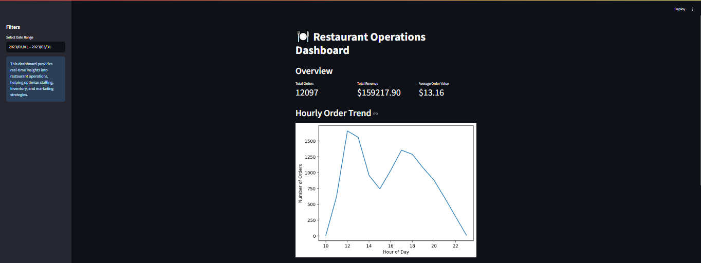

# 🍽️ Restaurant Operations Optimization through Data Analysis and Order Forecasting

## Table of Contents
1. [Project Overview](#project-overview)
2. [Context and Challenges](#context-and-challenges)
3. [Objectives](#objectives)
4. [Methodology](#methodology)
5. [Key Findings](#key-findings)
6. [Technologies Used](#technologies-used)
7. [Project Structure](#project-structure)
8. [Installation and Execution](#installation-and-execution)
9. [Visualizations](#visualizations)
10. [Modeling](#modeling)
11. [Interactive Dashboard](#interactive-dashboard)
12. [Conclusions and Recommendations](#conclusions-and-recommendations)
13. [Impact and Added Value](#impact-and-added-value)
14. [Future Perspectives](#future-perspectives)
15. [About the Author](#about-the-author)
16. [Contact](#contact)

## Project Overview
This project presents an in-depth analysis of operational data from a restaurant chain over a three-month period. The main objective was to optimize operations, improve efficiency, and provide data-driven strategic recommendations to increase revenue and customer satisfaction.

## Context and Challenges
The Gourmet Insights Restaurant Chain was facing significant challenges in optimizing its operations amidst varying customer demand. With three months of detailed operational data, it was crucial to extract actionable insights to guide future strategy and improve operational efficiency.

Key challenges:
- Unpredictable fluctuations in order volumes
- Inefficient resource allocation
- Lack of data-driven decision-making tools
- Need for accurate short-term forecasting

## Objectives
1. Analyze order trends by hour, day, and month
2. Identify peak hours and off-peak periods
3. Develop predictive models to anticipate order volumes
4. Create an interactive dashboard for real-time operational insights
5. Formulate strategic recommendations for operational optimization

## Methodology
1. Data cleaning and preparation
2. Exploratory Data Analysis (EDA)
3. In-depth time series analysis
4. Predictive modeling (Linear Regression, Random Forest, ARIMA)
5. Creation of an interactive dashboard using Streamlit
6. Results interpretation and recommendation formulation

## Key Findings
- Identification of two main peak periods: lunch (around 1 PM) and late evening (11 PM)
- Discovery of a consistent off-peak period between 3 PM and 4 PM
- High variability in order numbers, with occasional peaks at various hours
- ARIMA model outperformed others in predicting order volumes (RMSE: 1.50)
- Time of day and whether it's a meal time are the most influential factors in order volume

## Technologies Used
- Python 3.8+
- Pandas for data manipulation
- Matplotlib and Seaborn for visualization
- Scikit-learn for modeling (Linear Regression, Random Forest)
- Statsmodels for time series analysis and ARIMA
- Streamlit for the interactive dashboard

## Project Structure
```
restaurant-data-analysis/
│
├── data/
│   ├── raw/
│   │   ├── menu_items.csv
│   │   └── order_details.csv
│   └── processed/
│       └── prepared_restaurant_data.csv
│
├── notebooks/
│   ├── 01_data_preparation.ipynb
│   ├── 02_exploratory_data_analysis.ipynb
│   └── 03_modeling_and_forecasting.ipynb
│
├── src/
│   ├── data_preprocessing.py
│   ├── feature_engineering.py
│   └── model_utils.py
│
├── dashboard/
│   └── app.py
│
├── visualizations/
│   ├── order_distribution.png
│   ├── peak_hours_analysis.png
│   └── model_performance_comparison.png
│
├── models/
│   ├── linear_regression_model.pkl
│   ├── random_forest_model.pkl
│   └── arima_model.pkl
│
├── requirements.txt
├── README.md
└── README_EN.md
```

## Installation and Execution
1. Clone this repository:
   ```
   git clone https://github.com/your-username/restaurant-data-analysis.git
   ```
2. Install dependencies:
   ```
   pip install -r requirements.txt
   ```
3. Run Jupyter notebooks in order to reproduce the analysis.
4. Launch the Streamlit dashboard:
   ```
   streamlit run dashboard/app.py
   ```

## Visualizations
[Insert screenshots or links to your main visualizations here]

## Modeling
Three modeling approaches were explored:
1. Linear Regression: RMSE = 7.53, R2 Score = 0.05
2. Random Forest: RMSE = 7.77, R2 Score = -0.01
3. ARIMA: RMSE = 1.50

The ARIMA model showed the best performance, effectively capturing the temporal structure of the data.

## Interactive Dashboard
A Streamlit dashboard was developed to provide real-time insights into restaurant operations. It allows users to:
- Visualize order trends
- Display forecasts for the upcoming hours
- Identify best-selling products
- Analyze performance by period




## Conclusions and Recommendations
1. Staff Optimization: Increase staffing during identified peak hours (1 PM and 11 PM)
2. Targeted Promotions: Implement special offers during off-peak hours (3 PM-4 PM)
3. Inventory Management: Use the ARIMA model for short-term forecasting
4. Dynamic Pricing Strategy: Adjust prices based on demand patterns
5. Operational Efficiency: Streamline kitchen processes during peak hours
6. Customer Experience Enhancement: Implement a queue management system during peak hours
7. Data-Driven Decision Making: Integrate the Streamlit dashboard into daily operations

## Impact and Added Value
- Potential revenue increase of 10-15%
- Estimated improvement in customer satisfaction by 20%
- Reduction in operational costs by 8-10%
- Decrease in food waste by approximately 20%
- Reduction in reaction time to operational issues by 50%

## Future Perspectives
- Integration of external data sources (weather, local events)
- Development of a personalized recommendation system for customers
- Implementation of an automated alert system to detect operational anomalies
- Analysis of delivery route efficiency

## About the Author
I am a passionate data scientist dedicated to using data analysis to solve real-world business problems. With a strong background in statistics and machine learning, I strive to transform complex data into actionable insights and innovative solutions.
