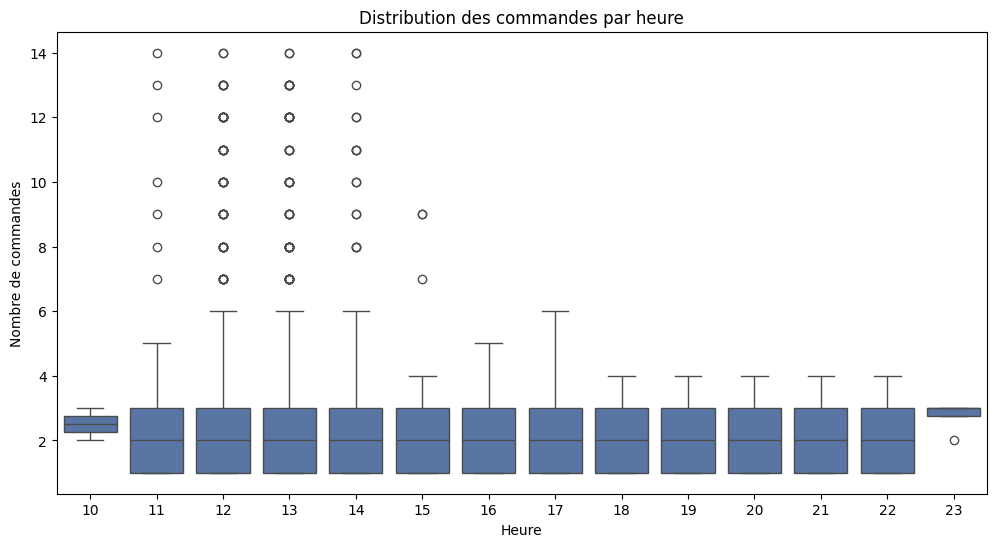
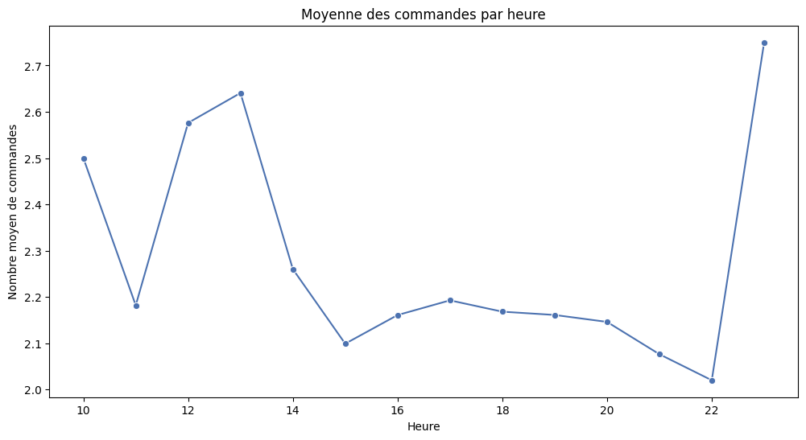
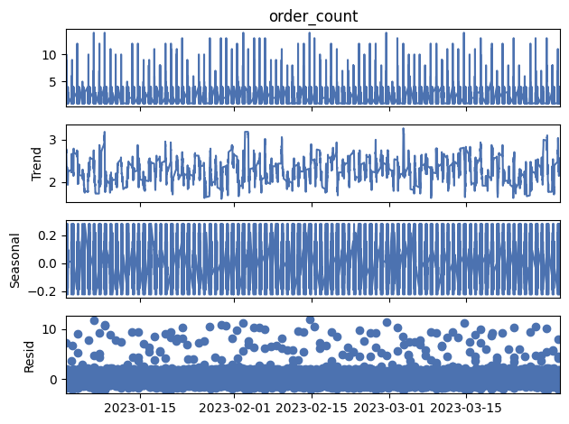
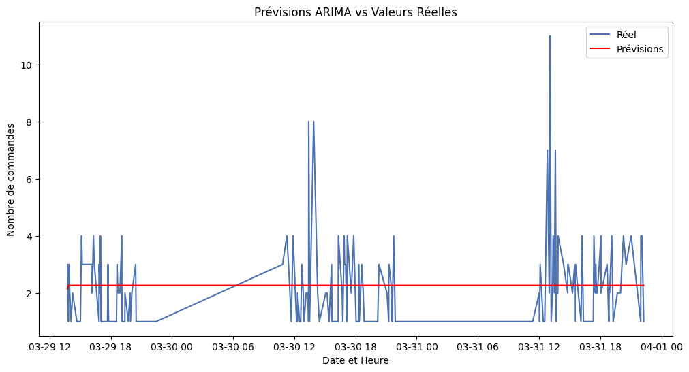

# Analyse de Données d'un Restaurant : Insights pour l'Optimisation Opérationnelle

## Table des Matières
1. [Introduction](#introduction)
2. [Objectifs du Projet](#objectifs-du-projet)
3. [Données](#données)
4. [Méthodologie](#méthodologie)
5. [Résultats Clés](#résultats-clés)
6. [Visualisations](#visualisations)
7. [Modélisation](#modélisation)
8. [Conclusions et Recommandations](#conclusions-et-recommandations)
9. [Technologies Utilisées](#technologies-utilisées)
10. [Installation et Exécution](#installation-et-exécution)
11. [Perspectives Futures](#perspectives-futures)

## Introduction
Ce projet analyse en profondeur les données opérationnelles d'un restaurant sur une période de trois mois. L'objectif est de fournir des insights actionnables pour optimiser les opérations, améliorer l'efficacité et potentiellement augmenter les revenus.

## Objectifs du Projet
- Analyser les tendances de commandes par heure, jour et mois
- Identifier les périodes de pointe et les heures creuses
- Développer un modèle prédictif pour anticiper le volume de commandes
- Formuler des recommandations basées sur les données pour l'optimisation opérationnelle

## Données
Le jeu de données comprend :
- Informations sur les articles du menu (nom, catégorie, prix)
- Détails des commandes (date, heure, articles commandés)
- Période couverte : Janvier à Mars 2023

## Méthodologie
1. Nettoyage et préparation des données
2. Analyse exploratoire des données (EDA)
3. Analyse temporelle approfondie
4. Modélisation prédictive (Random Forest et ARIMA)
5. Interprétation des résultats et formulation de recommandations

## Résultats Clés
- Identification de deux pics de commandes : à 13h (déjeuner) et 23h
- Période creuse identifiée entre 15h et 16h
- Forte variabilité dans le nombre de commandes, avec des pics occasionnels à toutes les heures
- Les caractéristiques les plus influentes sont l'heure de la journée et si c'est une heure de repas

## Visualisations

### Distribution des Commandes par Heure


Ce graphique montre la variabilité des commandes pour chaque heure d'ouverture du restaurant.

### Moyenne des Commandes par Heure


Ce graphique illustre clairement les pics et les creux dans le volume moyen de commandes tout au long de la journée.

### Décomposition de la Série Temporelle


Cette visualisation décompose nos données en tendance, saisonnalité et résidus, offrant un aperçu des patterns sous-jacents.

## Modélisation

Trois approches de modélisation ont été explorées pour prédire le nombre de commandes :

1. Régression Linéaire
   - Caractéristiques : heure, jour de la semaine, mois
   - Performance : RMSE = 7.53, R2 Score = 0.05

2. Random Forest
   - Caractéristiques : heure, jour de la semaine, mois, est_weekend, est_heure_repas
   - Performance : RMSE = 7.77, R2 Score = -0.01

3. ARIMA (Modèle de séries temporelles)
   - Paramètres : (1,1,1)
   - Performance : RMSE = 1.50

### Comparaison des Performances des Modèles

| Modèle            | RMSE | R2 Score |
|-------------------|------|----------|
| Régression Linéaire | 7.53 | 0.05     |
| Random Forest     | 7.77 | -0.01    |
| ARIMA             | 1.50 | N/A      |

Le modèle ARIMA a montré la meilleure performance en termes de RMSE, suggérant qu'une approche de séries temporelles est plus adaptée à ce problème de prévision.

### Prévisions ARIMA vs Valeurs Réelles


Ce graphique compare les prédictions du modèle ARIMA aux valeurs réelles observées, illustrant la capacité du modèle à capturer les tendances générales, mais aussi ses limitations pour prédire les pics extrêmes.

## Analyse des Résultats de Modélisation

1. **Régression Linéaire** : Ce modèle simple a fourni une base de référence, mais sa performance limitée indique que la relation entre les variables n'est pas purement linéaire.

2. **Random Forest** : Malgré sa capacité à capturer des relations non linéaires, ce modèle n'a pas surpassé la régression linéaire, suggérant que la complexité ajoutée n'a pas compensé le risque de surapprentissage.

3. **ARIMA** : Ce modèle a significativement surpassé les autres en termes de RMSE, démontrant l'importance de prendre en compte la structure temporelle des données pour ce problème spécifique.

L'évolution de notre approche de modélisation, du plus simple au plus complexe, démontre une démarche méthodique et réfléchie dans l'exploration des données et le choix du modèle le plus approprié.

## Conclusions et Recommandations
1. Optimisation des ressources pendant les heures de pointe (13h et 23h)
2. Mise en place de promotions pendant les heures creuses (15h-16h)
3. Développement d'un système flexible pour gérer les pics imprévus
4. Amélioration du modèle prédictif en explorant des approches plus avancées (SARIMA, Prophet, LSTM)
5. Considération d'une stratégie de tarification dynamique

## Technologies Utilisées
- Python 3.8+
- Pandas pour la manipulation des données
- Matplotlib et Seaborn pour la visualisation
- Scikit-learn pour le modèle Random Forest
- Statsmodels pour l'analyse de séries temporelles et ARIMA

## Installation et Exécution
```bash
git clone [URL_DU_REPO]
cd [NOM_DU_REPO]
pip install -r requirements.txt
jupyter notebook Restaurant_Data_Analysis.ipynb
```

## Perspectives Futures
- Intégration de données externes (météo, événements locaux)
- Développement d'un dashboard interactif pour le suivi en temps réel
- Exploration de techniques de deep learning pour améliorer les prévisions